# Conti_Ransomware
RANSOMWARE LAB by Tryhackme

This challenge involves Splunk to investigate an Exchange server that was compromised . By the Conti ransomware. At of the lab we learn how the attackers compromised the server.

<p align="center">
<br/>
  
<br/>
<br/>
</p>

# SPLUNK Analysis
Splunk log analysis
- patten detection and recognition
- index=* | top limit=100 Image
- index=*  Image="c:\\Users\\Administrator\\Documents\\cmd.exe" Hashes="MD5=290C7DFB01E50CEA9E19DA81A781AF2C,SHA256=53B1C1B2F41A7FC300E97D036E57539453FF82001DD3F6ABF07F4896B1F9CA22,IMPHASH=23F815785DB238377F4513BE54DBA574"
- index=* EventCode=11 Image="c:\\Users\\Administrator\\Documents\\cmd.exe"
- index=* 4720
- index=* sourcetype="WinEventLog:Microsoft-Windows-Sysmon/Operational"
- index=* sourcetype="WinEventLog:Microsoft-Windows-Sysmon/Operational" EventCode=8 TargetImage="C:\\Windows\\System32\\lsass.exe"
-  attrib.exe -r \\win-aoqkg2as2q7.bellybear.local\C$\Program Files\Microsoft\Exchange Server\V15\FrontEnd\HttpProxy\owa\auth\i3gfPctK1c2x.aspx
-  

# Task 1
Some employees from your company reported that they can’t log into Outlook. The Exchange system admin also reported that he can’t log in to the Exchange Admin Center. After initial triage, they discovered some weird readme files settled on the Exchange server.  (ransomware note which is readme.file --conti(ransom))

<p align="center">
<br/>
  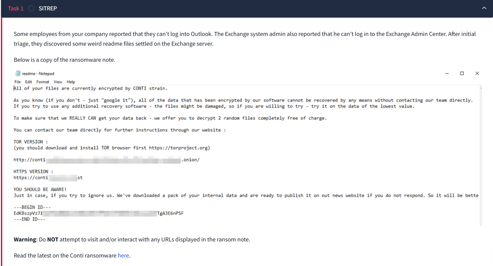
<br/>
<br/>
</p>

CLICK on Complite (for task 2)

# Task 2
<p align="center">
<br/>
  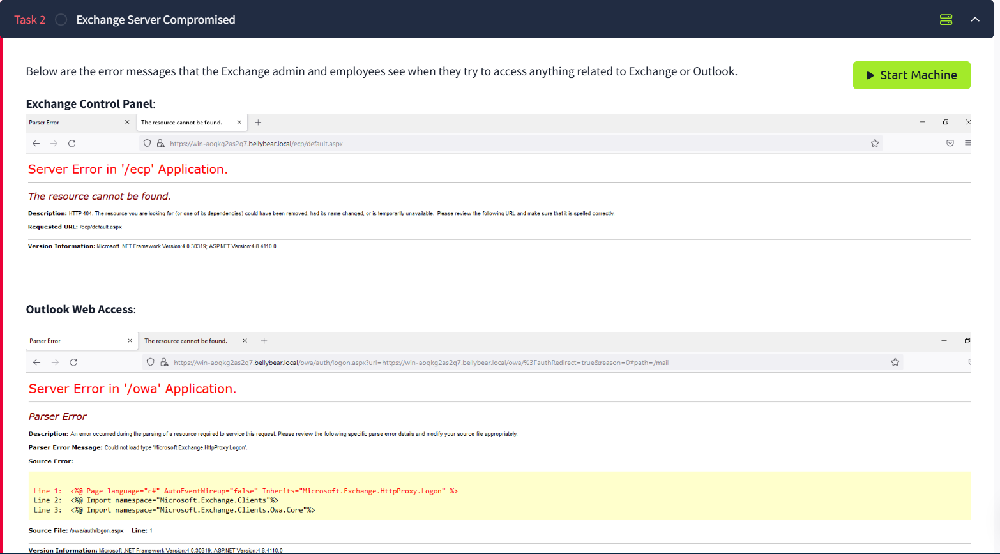
<br/>
<br/>
</p>

Microsoft Exchange Server: is a mail server and calendaring server developed by Microsoft. It runs exclusively on Windows Server operating systems and is designed to manage various forms of digital communication within an organization

Exchange Server integrates seamlessly with other Microsoft products, such as Outlook and SharePoint, to create a unified communication environment

TASK: You are assigned to investigate this situation. Use SPLUNK to answer the questions below regarding the Conti ransomware. 

# start the Meachine

<p align="center">
<br/>
  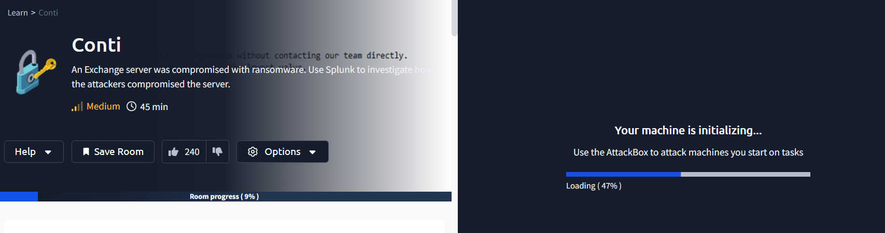
<br/>
<br/>
</p>

Question 1: Can you identify the location of the ransomware?

HINT: Look for a common Windows binary located in an unusual location. explain

In essence, both terms are related to the representation and execution of data in a computer system. Binary files are the raw, executable form of programs, while IMAGE can refer to complete copies of disks or memory states that include binary data.

```
index=* | top limit=100 Image
```

<p align="center">
<br/>
  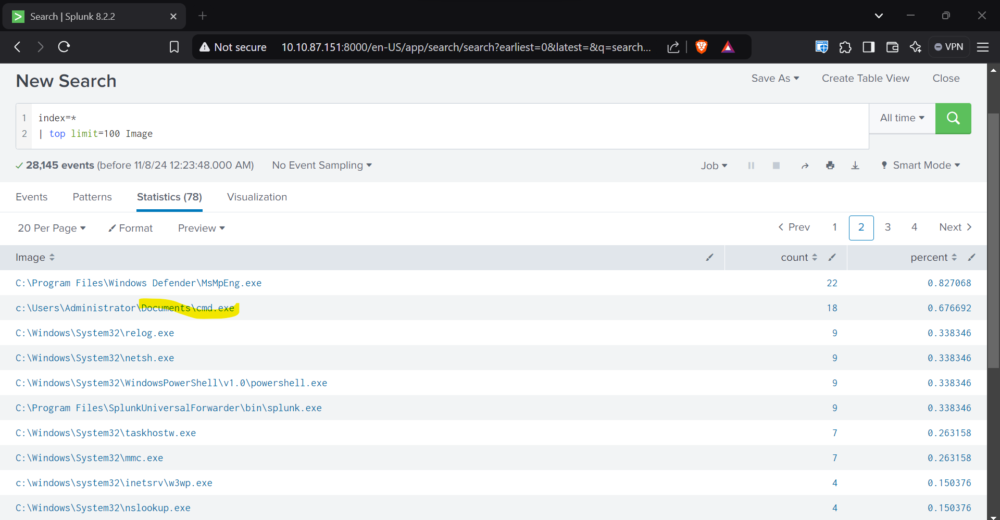
<br/>
<br/>
</p>

Question 2: What is the Sysmon event ID for the related file creation event?

HINT: google it 

Sysmon Event ID 11: This event is logged by Sysmon (System Monitor) when a file is created or overwritten. It's useful for monitoring critical locations like the Startup folder, temporary directories, and download directories, which are common targets for malware

Question 3: Can you find the MD5 hash of the ransomware?

got to the ransomware location click on view events & select field type (filter for) 'Hash'

```
 index=*  Image="c:\\Users\\Administrator\\Documents\\cmd.exe" Hashes="MD5=290C7DFB01E50CEA9E19DA81A781AF2C,SHA256=53B1C1B2F41A7FC300E97D036E57539453FF82001DD3F6ABF07F4896B1F9CA22,IMPHASH=23F815785DB238377F4513BE54DBA574"
```

<p align="center">
<br/>
  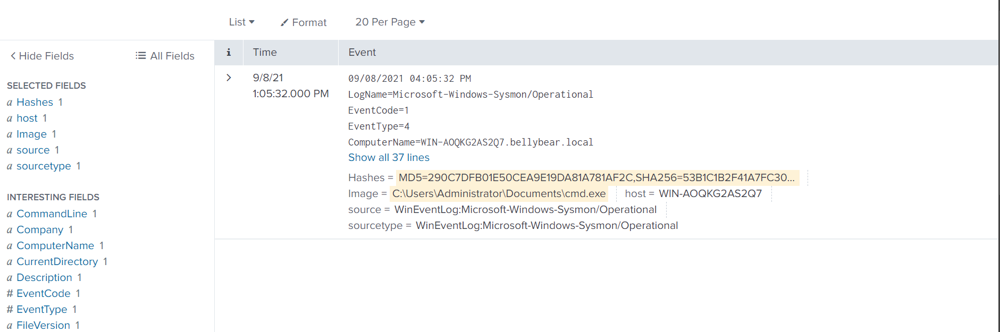
<br/>
<br/>
</p>

Question 4: What file was saved to multiple folder locations?

agine we are looking for file creation event

<p align="center">
<b>Root User</b>
<br/>
  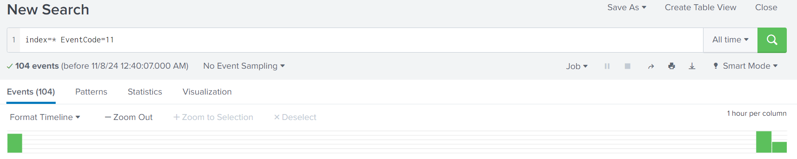
<br/>
<br/>
</p>

By looking at TargetFileName field and see readme.txt stored in multiple locations.

<p align="center">
<br/>
  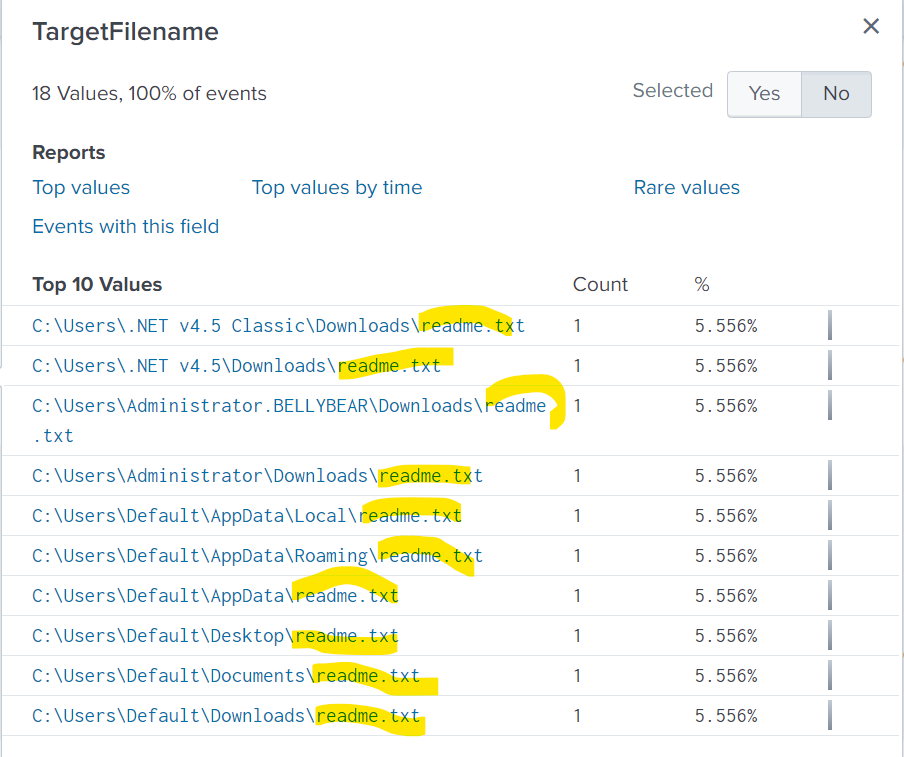
<br/>
<br/>
</p>


Question 5: What was the command the attacker used to add a new user to the compromised system?


<p align="center">
<br/>
  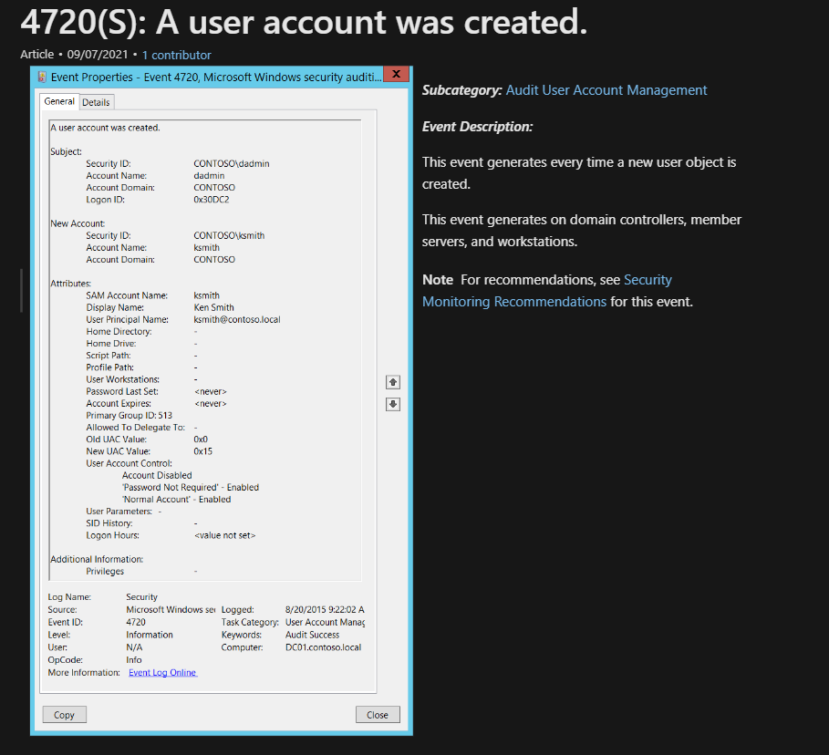
<br/>
<br/>
</p>


```index=* Event Code=4720 ```

<p align="center">
<br/>
  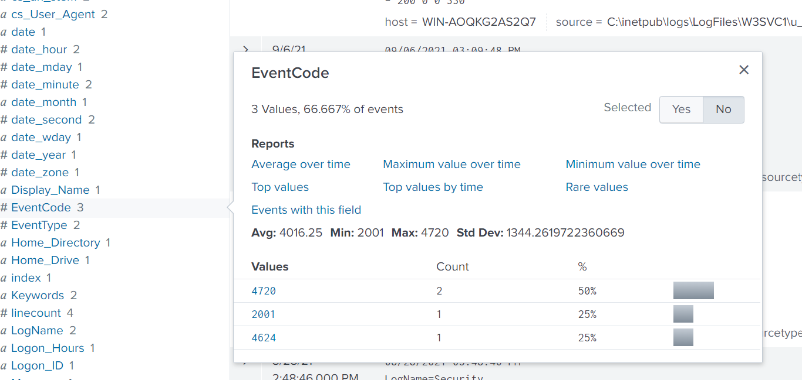
<br/>
<br/>
</p>

click on ``` 4270 ```

<p align="center">
<br/>
  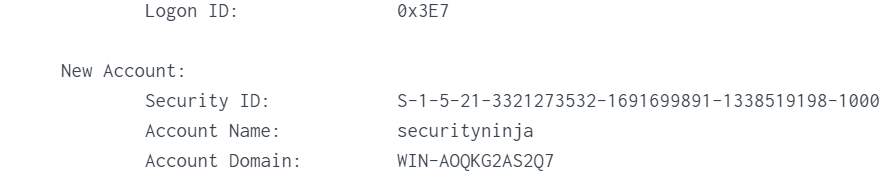
<br/>
<br/>
</p>

``` index=* securityninja ```
click on command line (under intersting filed)

<p align="center">
<br/>
  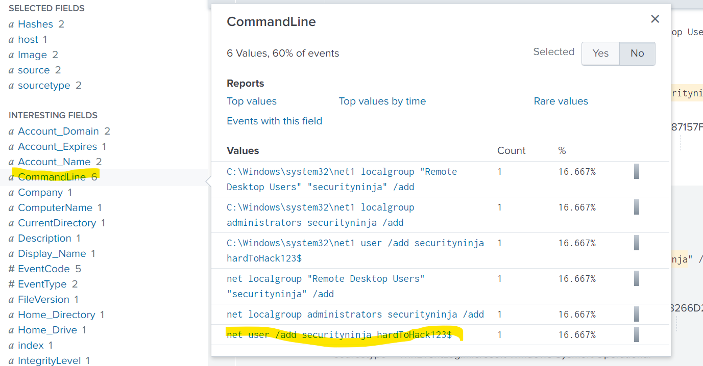
<br/>
<br/>
</p>

Question 6: The attacker migrated the process for better persistence. What is the migrated process image (executable), and what is the original process image (executable) when the attacker got on the system?

HINT: sysmon Event Code 8

```
index=* Event Code=8

```
click on 8

<p align="center">
<br/>
  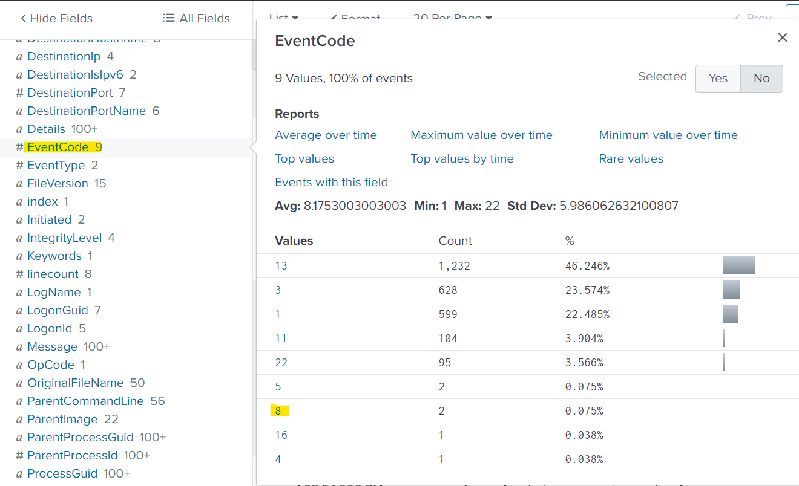
<br/>
<br/>
</p>

look for image click it 

<p align="center">
<br/>
  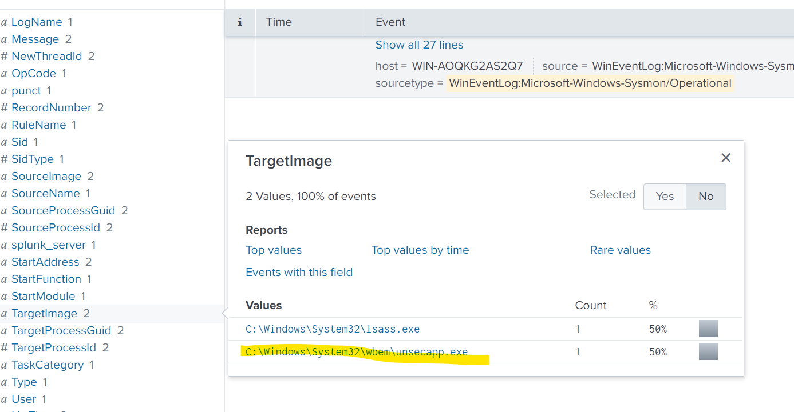
<br/>
<br/>
</p>

click for unsecapp look at sourceimage & targetimage

<p align="center">
<br/>
  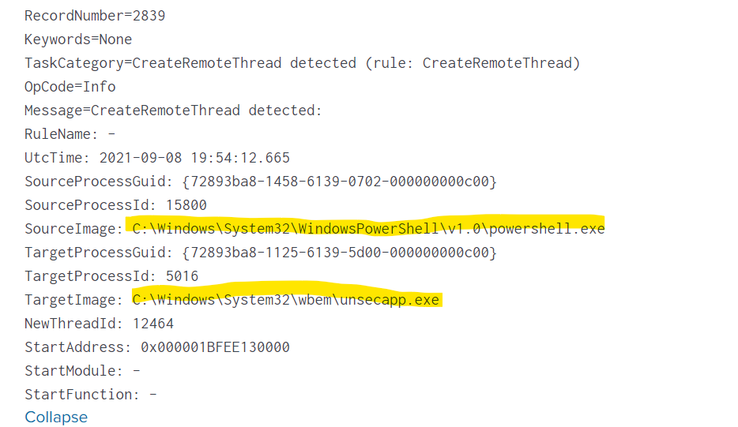
<br/>
<br/>
</p>

Question 7: The attacker also retrieved the system hashes. What is the process image used for getting the system hashes?

HINT: Try Sysmon event code 8 & check Target Image.

```
index=* sourcetype="WinEventLog:Microsoft-Windows-Sysmon/Operational" EventCode=8 TargetImage="C:\\Windows\\System32\\lsass.exe"
```
This process deals with authentication and authorization services for the system and handles hashes as well & NT , LM , KERBEROS TICKETS

<p align="center">
<br/>
  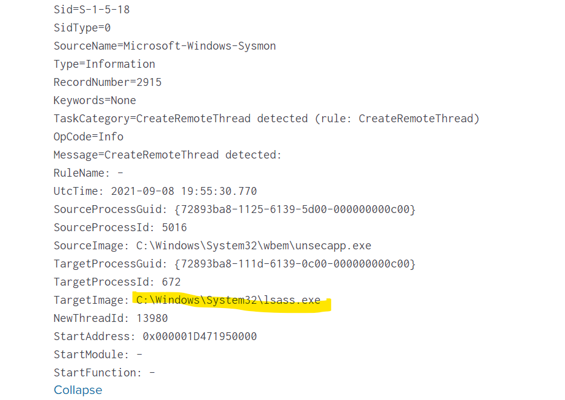
<br/>
<br/>
</p>

Question 8: What is the web shell the exploit deployed to the system?

hint: IIS logs for post requests

Internet Information Services (IIS) it host websites ,application using microsoft 
technology including (aspx_file)

``` index=*.aspx ```

If we look at task 2 in error message coudnot found aspx file


<p align="center">
<br/>
  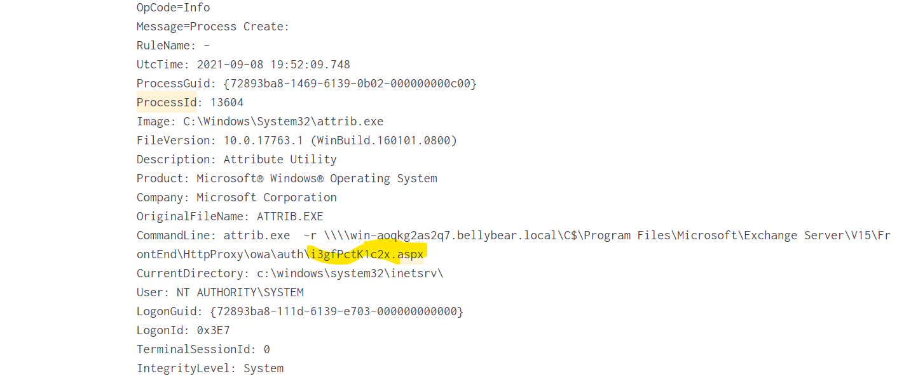
<br/>
<br/>
</p>

Question 9: What is the command line that executed this web shell?

```
attrib.exe  -r \\\\win-aoqkg2as2q7.bellybear.local\C$\Program Files\Microsoft\Exchange Server\V15\FrontEnd\HttpProxy\owa\auth\i3gfPctK1c2x.aspx
```
overall the command is to remove read only from i3gfPctK1c2x.aspx(this) file which is located at authencation at outlook webapp or exchange server

<p align="center">
<br/>
  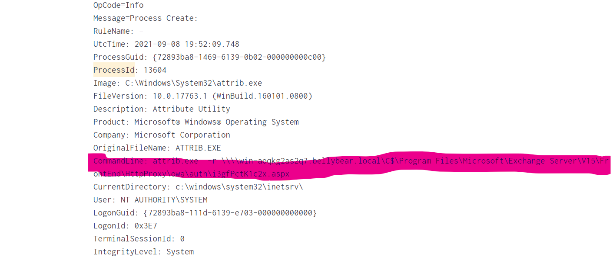
<br/>
<br/>
</p>

Question 10: What three CVEs did this exploit leverage?

CVE-2020-0796,CVE-2018-13374,CVE-2018-13379

<p align="center">
<br/>
  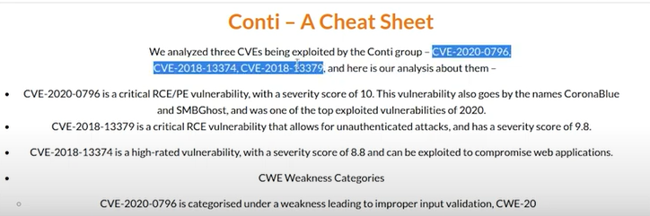
<br/>
<br/>
</p>


